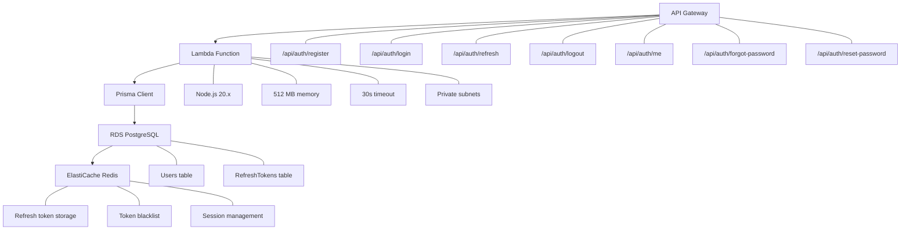

## Weekly Objective

This week focuses on building and deploying the core serverless backend API for the Travel Platform. The emphasis is on setting up Lambda functions with TypeScript, integrating Prisma ORM, implementing JWT authentication, and configuring API Gateway with proper CORS and rate limiting.

## Tasks To Be Carried Out This Week

<table>
  <thead>
    <tr>
      <th>Day</th>
      <th>Task</th>
      <th>Start Date</th>
      <th>Completion Date</th>
      <th>Reference Material</th>
    </tr>
  </thead>
  <tbody>
    <tr>
      <td>1</td>
      <td>
        <ul>
          <li><a href="1-day1-lambda-setup/">Setup Lambda function for Travel Platform API</a></li>
          <li><a href="1-day1-lambda-setup/">Create Lambda Layer for node_modules dependencies</a></li>
          <li><a href="1-day1-lambda-setup/">Configure Lambda with VPC access to RDS and Redis</a></li>
          <li><a href="1-day1-lambda-setup/">Setup TypeScript build process and deployment script</a></li>
        </ul>
      </td>
      <td>06/15/2026</td>
      <td>06/15/2026</td>
      <td>
        <ul>
          <li><a href="https://docs.aws.amazon.com/lambda/latest/dg/nodejs-handler.html">Lambda Node.js Functions</a></li>
          <li><a href="https://docs.aws.amazon.com/lambda/latest/dg/configuration-layers.html">Lambda Layers</a></li>
          <li><a href="https://docs.aws.amazon.com/lambda/latest/dg/configuration-vpc.html">Lambda VPC Configuration</a></li>
        </ul>
      </td>
    </tr>
    <tr>
      <td>2</td>
      <td>
        <ul>
          <li><a href="2-day2-prisma-integration/">Integrate Prisma ORM with Lambda</a></li>
          <li><a href="2-day2-prisma-integration/">Configure Prisma connection pooling for Lambda</a></li>
          <li><a href="2-day2-prisma-integration/">Create database schema and run migrations</a></li>
          <li><a href="2-day2-prisma-integration/">Test database connectivity from Lambda</a></li>
        </ul>
      </td>
      <td>06/16/2026</td>
      <td>06/16/2026</td>
      <td>
        <ul>
          <li><a href="https://www.prisma.io/docs/guides/deployment/deployment-guides/serverless/deploy-to-aws-lambda">Prisma on AWS Lambda</a></li>
          <li><a href="https://www.prisma.io/docs/concepts/components/prisma-client/working-with-prismaclient/connection-management">Connection Management</a></li>
          <li><a href="https://www.prisma.io/docs/concepts/components/prisma-schema">Prisma Schema</a></li>
        </ul>
      </td>
    </tr>
    <tr>
      <td>3</td>
      <td>
        <ul>
          <li><a href="3-day3-auth-module/">Build Authentication module with JWT</a></li>
          <li><a href="3-day3-auth-module/">Implement user registration with bcrypt password hashing</a></li>
          <li><a href="3-day3-auth-module/">Create login endpoint with JWT and refresh tokens</a></li>
          <li><a href="3-day3-auth-module/">Implement token refresh, logout, and password reset</a></li>
        </ul>
      </td>
      <td>06/17/2026</td>
      <td>06/17/2026</td>
      <td>
        <ul>
          <li><a href="https://jwt.io/introduction">JWT Introduction</a></li>
          <li><a href="https://www.npmjs.com/package/bcrypt">Bcrypt for Node.js</a></li>
          <li><a href="https://docs.aws.amazon.com/lambda/latest/dg/security-iam.html">Lambda Security Best Practices</a></li>
        </ul>
      </td>
    </tr>
    <tr>
      <td>4</td>
      <td>
        <ul>
          <li><a href="4-day4-api-gateway/">Configure API Gateway for REST API</a></li>
          <li><a href="4-day4-api-gateway/">Set up Lambda proxy integration</a></li>
          <li><a href="4-day4-api-gateway/">Configure CORS and request validation</a></li>
          <li><a href="4-day4-api-gateway/">Implement rate limiting (100 requests/min)</a></li>
        </ul>
      </td>
      <td>06/18/2026</td>
      <td>06/18/2026</td>
      <td>
        <ul>
          <li><a href="https://docs.aws.amazon.com/apigateway/latest/developerguide/api-gateway-create-api-as-simple-proxy-for-lambda.html">Lambda Proxy Integration</a></li>
          <li><a href="https://docs.aws.amazon.com/apigateway/latest/developerguide/how-to-cors.html">Enable CORS</a></li>
          <li><a href="https://docs.aws.amazon.com/apigateway/latest/developerguide/api-gateway-request-throttling.html">Throttle API Requests</a></li>
        </ul>
      </td>
    </tr>
    <tr>
      <td>5</td>
      <td>
        <ul>
          <li><a href="5-day5-testing-deployment/">Test authentication endpoints and deployment</a></li>
          <li><a href="5-day5-testing-deployment/">Implement request validation with Zod</a></li>
          <li><a href="5-day5-testing-deployment/">Set up error handling and logging with Winston</a></li>
          <li><a href="5-day5-testing-deployment/">Test cold start and warm start performance</a></li>
        </ul>
      </td>
      <td>06/19/2026</td>
      <td>06/19/2026</td>
      <td>
        <ul>
          <li><a href="https://zod.dev/">Zod Validation</a></li>
          <li><a href="https://www.npmjs.com/package/winston">Winston Logger</a></li>
          <li><a href="https://docs.aws.amazon.com/lambda/latest/dg/best-practices.html">Lambda Best Practices</a></li>
        </ul>
      </td>
    </tr>
  </tbody>
</table>

## Detailed Technical Worklogs

- [Day 1: Lambda Function Setup and Layer Creation](1-day1-lambda-setup/)
- [Day 2: Prisma ORM Integration with Lambda](2-day2-prisma-integration/)
- [Day 3: Authentication Module with JWT](3-day3-auth-module/)
- [Day 4: API Gateway Configuration](4-day4-api-gateway/)
- [Day 5: Testing and Deployment](5-day5-testing-deployment/)

## Architecture Overview



The main design idea is simple:

- API Gateway handles public HTTP routing.
- Lambda runs the auth handlers and business logic.
- Prisma talks to PostgreSQL with connection pooling.
- Redis stores short-lived session state and token metadata.

## Key Technical Implementations

### Lambda Layer Structure
- **Size Limit:** 50MB uncompressed, 250MB total
- **Solution:** Create layer with all dependencies
- **Main Code:** Only application code

### Prisma Configuration
```prisma
generator client {
  provider = "prisma-client-js"
  binaryTargets = ["native", "rhel-openssl-1.0.x"]
}
```

### JWT Configuration
- **Access Token:** 1 hour expiration
- **Refresh Token:** 7 days expiration
- **Storage:** Redis for refresh tokens
- **Rotation:** New refresh token on each use

### Performance Targets
- **Cold Start:** < 1000ms
- **Warm Start:** < 300ms
- **Cache Hit:** < 200ms
- **Database Query:** < 100ms

## Authentication Endpoints (7 Total)

1. **POST /api/auth/register** - User registration with email validation
2. **POST /api/auth/login** - Login with JWT + refresh tokens
3. **POST /api/auth/refresh** - Refresh token rotation
4. **POST /api/auth/logout** - Blacklist refresh token
5. **GET /api/auth/me** - Get current user profile
6. **POST /api/auth/forgot-password** - Send password reset email
7. **POST /api/auth/reset-password** - Reset password with token

## Note For Mentors

Week 9 focuses on building the serverless backend foundation, including Lambda function setup with layers to handle dependency size limits, Prisma ORM integration with proper connection pooling for serverless environments, JWT authentication with refresh token rotation, and API Gateway configuration with CORS and rate limiting. By the end of the week, the authentication module will be fully functional and deployed.
