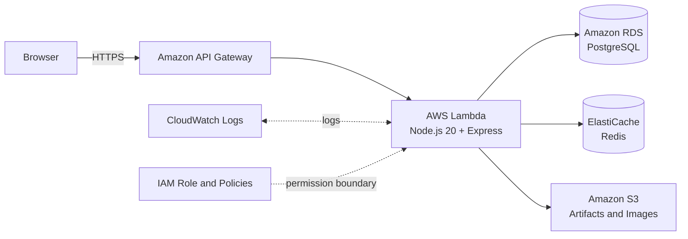

## Deployed MVP

The application uses a serverless API layer. API Gateway receives HTTPS requests and invokes one Lambda function that hosts the TypeScript and Express application. The function uses PostgreSQL as its system of record, Redis for short-lived cache and token-related data, and S3 for deployment artifacts and user-uploaded images.

## Why Serverless-First

| Decision | Rationale |
| --- | --- |
| API Gateway + Lambda | Removes server administration, scales with request volume, and is cost-effective for an MVP. |
| PostgreSQL on RDS | Fits transactional relationships among users, places, trips, reviews, and bookings. |
| Redis | Reduces repeated read pressure for frequently requested data and supports short-lived state. |
| S3 presigned uploads | Lets the browser upload images directly without granting it AWS credentials or proxying large files through Lambda. |
| VPC isolation | Keeps database and cache resources away from the public internet. |

The design keeps the request path small while leaving clean extension points for asynchronous processing, CDN delivery, managed identity, and richer search later.
