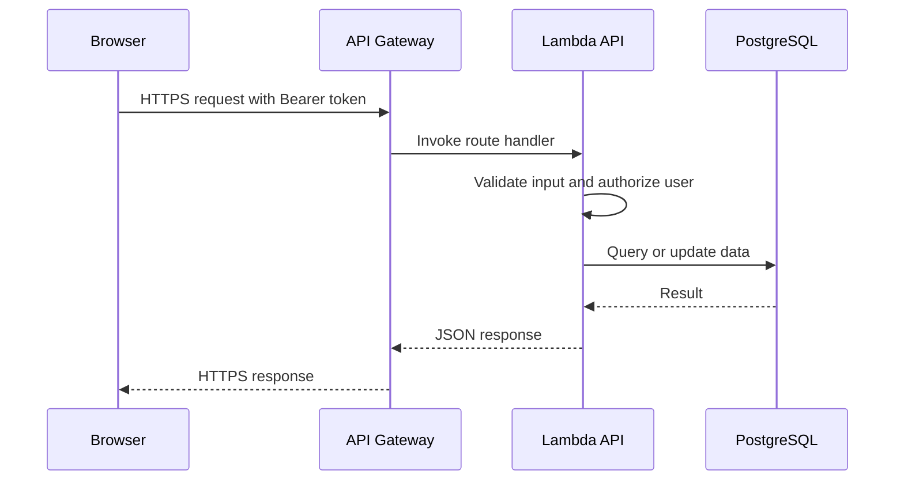

## 1. Authenticated API Request

Protected endpoints validate the JWT before business logic runs. Role checks are applied to actions such as reviewing business claims, editing another user's resource, or accessing administration functions.

## API Gateway Configuration

The HTTP API is configured with a default route and automatic deployment for the active stage.

## 2. Image Upload with a Presigned URL

1. The authenticated user asks the API for an upload URL.
2. Lambda checks ownership and creates a short-lived presigned S3 URL.
3. The browser uploads the image directly to S3.
4. The frontend stores or displays the returned file URL with the related place or review.

This approach avoids exposing AWS access keys to the browser and keeps image bytes out of the Lambda request path.

## 3. Review and Rating Update

A review request is validated, written to PostgreSQL, and reflected in the place's aggregate rating. For a higher-volume deployment, this calculation can move to an SQS-triggered worker so the user-facing request stays fast. That asynchronous extension is a future design option, not a dependency of the MVP.
